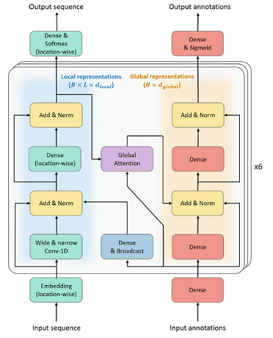

# proteinbert-pytorch



Implementation of ProteinBERT, a deep language model specifically designed for proteins.
The official implementation of ProteinBERT is available at [here](https://github.com/nadavbra/protein_bert).

## Installation

```bash
$ pip install proteinbert-pytorch-reproduction
```

## Usage

```python
from proteinbert_pytorch import ProteinBERT

vocab_size = 26
ann_size = 8943
seq_len = 512
bsz = 1

x_seq = torch.randint(0, vocab_size, (bsz, seq_len))
x_ann = torch.rand(bsz, ann_size)

model = ProteinBERT(vocab_size, ann_size)
x_seq_pred, x_ann_pred = model(x_seq, x_ann)
```

## Citations
```bibtex
@article{brandes2022proteinbert,
  title={ProteinBERT: a universal deep-learning model of protein sequence and function},
  author={Brandes, Nadav and Ofer, Dan and Peleg, Yam and Rappoport, Nadav and Linial, Michal},
  journal={Bioinformatics},
  volume={38},
  number={8},
  pages={2102--2110},
  year={2022},
  publisher={Oxford University Press}
}
```
